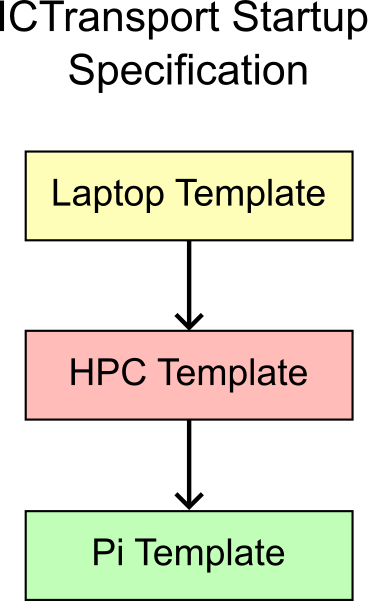

# ictransport -- A communication layer between the Pi and Iridis
<p align="center"></p>

To simplify the hackathon for you, we decided to create a semi-transparent layer to communicate numpy objects from Pi to HPC and back with the help of your laptop.

## University Security Policy
In accordance with Southampton Security policy, if you log in to GlobalProtect you
- **MUST** use the same account for Iridis and GlobalProtect
- **MUST NOT** hand the laptop you're signed in to your teammates. 

## Startup Procedure 
As this was written in about 24 hours of work, there is a huge dependency on the order of starting each process. From now, make sure to start them as pictured:

<p align="center"></p>

1. The laptop is the central puzzle piece to this, make sure to start it first.
2. The HPC is typically the listener. Start in second.
3. The Pi requests from Iridis. Start it last, or whenever you need something processed.

### Please also ensure to specify timeout as you don't want to ping the servers endlessly!

## Installation
You need to install ictransport on your *HPC instance* and *your laptop* to enable this communication layer (the Pi already has it installed).
1. On your laptop
   1. (Windows) Create a WSL to run Linux commands on (sorry windows users).
   2. Connect to [GlobalProtect](https://sotonproduction.service-now.com/serviceportal?id=kb_article_view&sys_kb_id=f04106b747e4d5583035862c736d43a2).
      - Remember, you
        - **MUST** use the same account for Iridis and
        - **MUST NOT** hand the laptop you're signed in to your teammates. 
   4. Clone this repository
      ```
      cd Downloads
      git clone https://github.com/mrontio/Innovation-Camp-2025.git
      cd Innovation-Camp-2025
      ```
   5. Create a virtial environment just for this.
      ```
      python -m venv ~/Downloads/ictransport-venv
      source ~/Downloads/ictransport-venv/bin/activate
      ```
   6. Install ictransport to the venv
      ```
      pip install -e .
      ```
   7. Edit [examples/laptop_template.py](./examples/laptop_template.py) with your credentials
      ```
      pi_username = ""
      pi_address = ""
      pi_share_path = "" # Please use an absolute path

      hpc_username = ""
      hpc_address = ""
      hpc_share_path = "" # Please use an absolute path
      ```
   8. Run [examples/laptop_template.py](./examples/laptop_template.py) & edit as needed for your demonstrator.
      ```
      cd examples
      python laptop_template.py
      >>> Initialising Laptop!
      >>> Laptop: A single file transport has been completed!
      ```

2. On Iridis
   1. Login
      ```
      ssh <user>@<address> # This is a TODO
      ```
   2. Git clone this repository
      ```
      cd Downloads
      git clone https://github.com/mrontio/Innovation-Camp-2025.git
      cd Innovation-Camp-2025
      ```
   3. Create a new virtual environment, or re-use the one you have created
      ```
      module load python
      python -m venv ~/hackathon-venv
      source ~/hackathon-venv/bin/activate
      ```
   4. Install this package into the venv
      ```
      pip install -e ./
      ```
   5. Transfer files from your code with these functions, as can be seen in [examples/hpc_template.py](./examples/hpc_template.py).
      ```
      # Create a NodeTransport object
      hpc = NodeTransport(pi=False, share_path=hpc_share_path)
      # Await for an input
      received_input = hpc.listen()
      # Do some calculations
      processed_output = received_input * 2
      # Send it back to the Pi
      hpc.send(processed_output)
      ```

3. On the Pi
   1. The `hackathon-venv` that you [initialised after signing off](../pi/initialisation) already contains ictransport.
   2. Use it within your code, such as in [examples/pi_template.py](./example/pi_template.py).

## Understanding the Algorithm
We encourage you to understand the algorithm, open issues as well as contributing to the code for the wider benefit! The algorithm consists of four main phases as hinted on the diagram on the top of the page. The algorithm also deploys a basic synchronisation process that you are free to improve. In the algorithm below we use file 1.npy as an example. If 1.npy already exists, 2.npy is used and so on. However, we encourage you to clear both share directories (i.e., in pi and hpc) after each run to avoid any issues. The automatically clears out the both pi_sync_file and hpc_sync_file.

### Phase Zero: Initialise Connections
   1. Laptop.init():
      - [t] Pi SFTP Connection
      - [t] HPC SFTP Connection

### Observe a state using Pi

### Phase One: Read from Pi
   1. Laptop.listen(pi):
      - Await 'Pi: 1-sent' in pi_sync_file.
      - Receive '1.npy' from pi_share_path.
      - Write 'Laptop: 1-received' to pi_sync_file.
   2. Pi.send()
      - Write '1.npy' to pi_share_path.
      - Write 'Pi: 1-sent' to pi_sync_file.
      - [t] Await 'Laptop: 1-received' in pi_sync_file.
      - Return success!

### Phase Two: Send to HPC
   1. Laptop.send(hpc):
      - Write '1.npy' to hpc_share_path.
      - Write 'Laptop: 1-sent' to hpc_sync_file.
      - [t] Await 'HPC: 0001-received' in hpc_sync_file.
      - Return success!
   2. HPC.listen()
      - Await 'Laptop: 1-sent' in hpc_sync_file.
      - Receive '1.npy' from hpc_share_path.
      - Write 'HPC: 1-received' to hpc_share_path.
      - Return as np array!

### Process '1.npy' in HPC

### Phase Three: Read from HPC
   1. Laptop.listen(hpc):
      - Await 'HPC: 1-out-sent' in hpc_sync_file.
      - Receive '1-out.npy' in hpc_share_path.
      - Return as np array!
   2. HPC.send()
      - Write '1-out.npy' to hpc_share_path.
      - Write 'HPC: 1-out-sent' to hpc_sync_file.
      - [t] Await 'Laptop: 1-out-received' in hpc_sync_file.
      - Return success!

### Phase Four: Send to Pi
   1. Laptop.send(pi):
      - Write '1-out.npy' to pi_share_path,
      - Write 'Laptop: 1-out-sent' to pi_sync_file.
      - [t] Await 'Pi: 1-out-received' in pi_sync_file.
      - Return success!
   2. Pi.listen()
      - Await 'Laptop: 1-out-sent' in pi_sync_file.
      - Receive '1-out.npy' in pi_share_path.
      - Write 'Pi: 1-out-received' to pi_sync_file.
      - Return as np array!

### Print the returned np array from HPC or further process it

### Laptop.close_connection() for Pi and HPC SFTP Connections when done

### Failure Modes
   - [t] = needs some sort of timeout for retry
