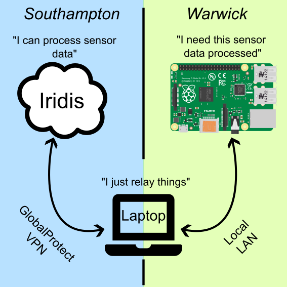

# ictransport -- A communication layer between the Pi and Iridis
<p align="center"></p>

To simplify the hackathon for you, we decided to create a semi-transparent layer to communicate numpy objects from Pi to HPC and back with the help of your laptop.

## Installation
You need to install ictransport on your *HPC instance* and *your laptop* to enable this communication layer (the Pi already has it installed).
1. On Iridis
   1. Login
      ```
      ssh <user>@<address> # This is a TODO
      ```
   2. Git clone this repository
      ```
      cd Downloads
      git clone https://github.com/mrontio/Innovation-Camp-2025.git
      cd Innovation-Camp-2025
      ```
   3. Create a new virtual environment, or re-use the one you have created
      ```
      module load python
      python -m venv ~/hackathon-venv
      source ~/hackathon-venv/bin/activate
      ```
   4. Install this package into the venv
      ```
      pip install -e ./
      ```
2. On your laptop
   1. (Windows) Create a WSL to run Linux commands on (sorry windows users).
   2. Connect to [GlobalProtect](https://sotonproduction.service-now.com/serviceportal?id=kb_article_view&sys_kb_id=f04106b747e4d5583035862c736d43a2).
   3. Clone this repository
      ```
      cd Downloads
      git clone https://github.com/mrontio/Innovation-Camp-2025.git
      cd Innovation-Camp-2025
      ```
   4. Create a virtial environment just for this.
      ```
      python -m venv ~/Downloads/ictransport-venv
      source ~/Downloads/ictransport-venv
      ```
   5. Edit the configuration file with the address of the Pi and Iridis
      ```
      TODO
      ```
   7. Execute laptop_loop.py, which
      - Monitors activity from both sides.
      - Copies files when needed.
